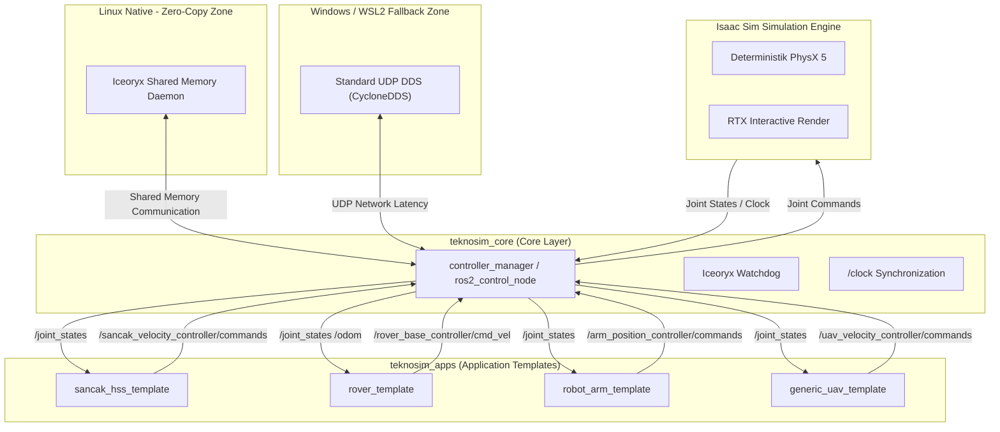

# TeknoSim: Modüler SITL & HITL Simülasyon Çekirdeği

**TeknoSim**, İnsansız Hava Sistemleri (UAV), Otonom Kara Araçları (Rover) ve Robot Kollar gibi her türlü otonom teknoloji projesini sıfır gecikmeyle test edebilen modüler, deterministik ve çapraz platform uyumlu bir **SITL (Software-in-the-Loop)** & **HITL (Hardware-in-the-Loop)** simülasyon (Kum Havuzu) çekirdeğidir.

---

## 🏗️ Sistem Mimarisi

TeknoSim, sistem bütünlüğünü korumak ve geliştirme süreçlerini kolaylaştırmak amacıyla iki temel katmana ayrılmıştır:

1.  **`teknosim_core` (Jenerik Çekirdek Katmanı):** `/clock` zaman senkronizasyonu, Iceoryx "Zombie Memory" Watchdog'u, donanım arayüz soyutlamaları ve telemetri düğümlerini barındıran dokunulmaz ve jenerik katmandır.
2.  **`teknosim_apps` (Kullanıcı Uygulama Katmanı):** Otonom GNC, görüntü işleme ve kontrol algoritmalarının koştuğu, kullanıcıların özgürce proje geliştirebildiği uygulama katmanıdır.

---

## 📊 ROS 2 Ağ Haberleşme Topolojisi

Aşağıdaki Mermaid diyagramı, TeknoSim ekosistemindeki simülasyon, donanım kontrolör arayüzü ve kullanıcı şablonlarının haberleşme yapısını göstermektedir:



---

## 💻 İşletim Sistemi & Performans Kuralları

### 🚀 1. Linux Native (Önerilen)
*   **İletişim Standardı:** Tamamen **Iceoryx (Shared Memory)** tabanlıdır.
*   **Gecikme:** Konteynerler arası ve Isaac Sim - Konteyner arası iletişimde **sıfır gecikme (Zero-Copy)** garanti edilir.
*   **Performans:** Fiziksel determinizm ve gerçek zamanlı (Real-Time) kontrol döngüleri en yüksek seviyededir.

### 💻 2. Windows (WSL2)
*   **İletişim Standardı:** Windows Host üzerindeki Isaac Sim ile WSL2 içindeki Docker/ROS 2 arasında paylaşımlı hafıza (IPC) kısıtlamaları nedeniyle **UDP DDS (CycloneDDS vb.)** "Fallback" protokolü kullanılır.
*   **Gecikme:** Ağ katmanı gecikmesi (Latency) mevcuttur. Geliştirme ve yarı-performanslı testler için idealdir, fakat kritik real-time testler için Linux Native kullanılmalıdır.

### 🌐 3. HITL (Donanım) İletişimi
*   Windows/WSL2 ortamında yaşanan USB/Serial passthrough uyumsuzluklarını ve gecikmelerini aşmak için gerçek donanımlarla (ESP32, Pixhawk vb.) asenkron haberleşme standardı **micro-XRCE-DDS Wi-Fi (UDP)** protokolü üzerine kurulmuştur.

---

## 📦 Mevcut Blueprint Şablonları

`teknosim_apps/templates/` dizini altında kullanıma hazır, sıfır kod değişikliğiyle derlenip simülasyonda hareket edebilecek standart ROS 2 şablonları:

1.  **`sancak_hss_template` (UAV):** `rotor1_joint`'ten `rotor4_joint`'e kadar 4 pervaneli quadrotor modelidir. Motor hızları `velocity_controllers/JointGroupVelocityController` ile yönetilir.
2.  **`rover_template` (Otonom Kara Aracı):** `left_wheel_joint` ve `right_wheel_joint` ile diferansiyel sürüş (`diff_drive_controller/DiffDriveController`) sunan standart mobil robot tabanıdır.
3.  **`robot_arm_template` (Robotik Kol):** `joint1`'den `joint6`'ya kadar 6 serbestlik dereceli endüstriyel manipülatördür. Eklemler `position_controllers/JointGroupPositionController` ile kontrol edilir.
4.  **`generic_uav_template` (Genel İHA):** Genel kullanım için tasarlanmış, `motor1_joint`'ten `motor4_joint`'e 4 pervaneli jenerik UAV şablonudur.

---

## 🛠️ Kurulum, Derleme ve Çalıştırma

### 1. Çalışma Alanının Derlenmesi
```bash
# Proje kök dizinine gidin
cd /home/yavuz/projects/tekno-sim

# Tüm şablon paketlerini colcon ile derleyin
colcon build --symlink-install

# ROS 2 ortamını kaynak olarak yükleyin
source install/setup.bash
```

### 2. Çalışma Modu (TEKNOSIM_MODE) Seçimi ve Çalıştırma
Her şablon paketi, `TEKNOSIM_MODE` ortam değişkeniyle SITL veya HITL moduna uyum sağlar.

*   **SITL Modu (Simülasyon):**
    ```bash
    export TEKNOSIM_MODE=SITL
    ros2 launch sancak_hss_template competition.launch.py
    ```

*   **HITL Modu (Donanım Entegrasyonu):**
    ```bash
    export TEKNOSIM_MODE=HITL
    ros2 launch sancak_hss_template competition.launch.py
    ```

Her şablon paketi çalıştırıldığında seçilen işletim modunu ekrana yazdırır ve `controller_manager` aracılığıyla simülasyon köprülerini otomatik olarak aktif eder.
